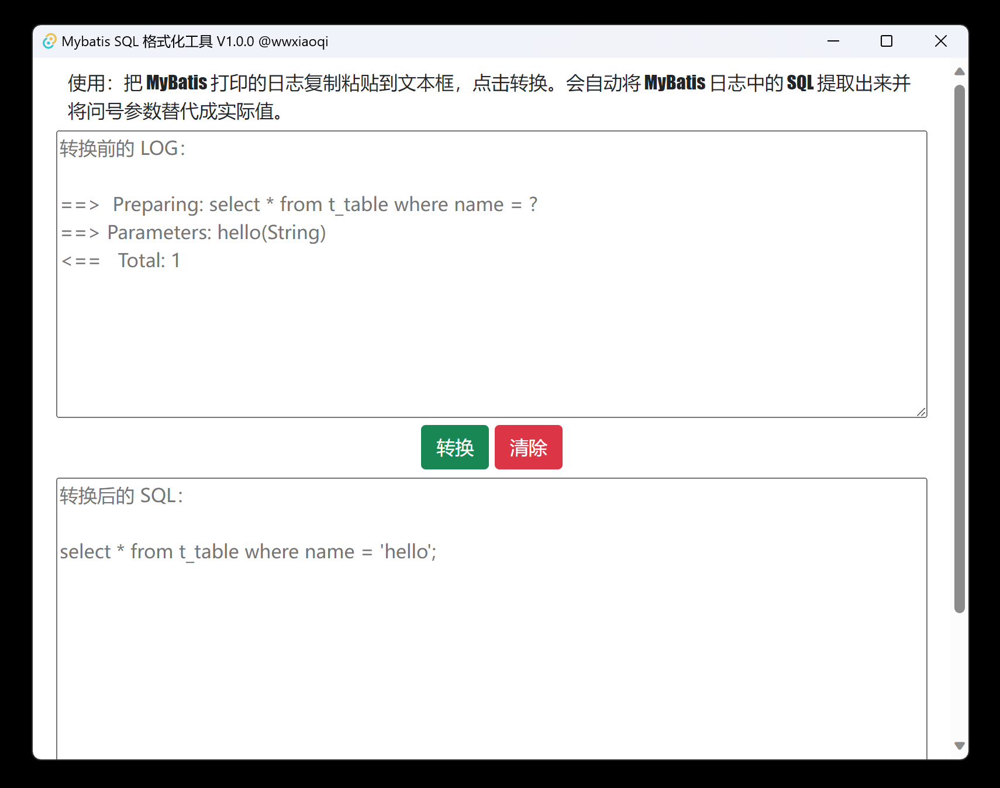

<h1 align="center">
  
  <br>
  Mybatis SQL 格式化工具
  <br>
</h1>

## 安装
请在 [release](https://github.com/wwxiaoqi/mybatis-sql-tauri-app/releases) 里面下载。

## Screenshots
<div align="center">
  
</div>

## 构建
安装 Rust 和 Nodejs，详细信息请参阅 [这里](https://tauri.app/v1/guides/getting-started/prerequisites)。

```shell
## 安装 pnpm
npm install -g pnpm

## 安装 packages
pnpm install

## 运行
pnpm tauri dev

## 构建
pnpm tauri build

## 构建 32 位
pnpm tauri build --target i686-pc-windows-msvc

## 构建 64 位
pnpm tauri build --target aarch64-pc-windows-msvc
```

## 许可证/授权
Apache License Version 2.0, January 2004 http://www.apache.org/licenses
